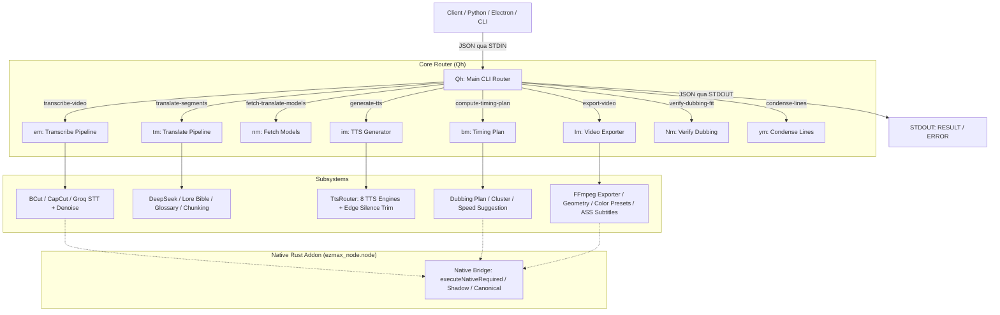

# TÀI LIỆU KỸ THUẬT CHI TIẾT FILE `node_helper.js`
> **Dự án**: `transcript-processor` (ezmaxsub helper)  
> **Phiên bản**: `2.3.2`  
> **Tài liệu tạo ngày**: 09/09/2026  
> **Mục đích**: Tài liệu hóa toàn diện tất cả các phân hệ, mô-đun, hàm, cơ chế giao tiếp CLI và giao diện lập trình (API) bên trong file `node_helper.js`.

---

## MỤC LỤC
1. [TỔNG QUAN HỆ THỐNG](#1-tổng-quan-hệ-thống)
2. [KIẾN TRÚC TỔNG THỂ & SƠ ĐỒ LUỒNG](#2-kiến-trúc-tổng-thể--sơ-đồ-luồng)
3. [GIAO THỨC CLI VÀ CÁC ACTION ĐẦU VÀO/ĐẦU RA (STDIN/STDOUT)](#3-giao-thức-cli-và-các-action-đầu-vàođầu-ra-stdinstdout)
   - [3.1. Giao thức truyền thông](#31-giao-thức-truyền-thông)
   - [3.2. Action: `transcribe-video`](#32-action-transcribe-video)
   - [3.3. Action: `translate-segments`](#33-action-translate-segments)
   - [3.4. Action: `fetch-translate-models`](#34-action-fetch-translate-models)
   - [3.5. Action: `generate-tts`](#35-action-generate-tts)
   - [3.6. Action: `export-video`](#36-action-export-video)
   - [3.7. Action: `compute-timing-plan`](#37-action-compute-timing-plan)
   - [3.8. Action: `verify-dubbing-fit`](#38-action-verify-dubbing-fit)
   - [3.9. Action: `condense-lines`](#39-action-condense-lines)
4. [DANH SÁCH & CHI TIẾT 48 MODULES NỘI BỘ](#4-danh-sách--chi-tiết-48-modules-nội-bộ)
   - [Nhóm 1: Native Core, Rust Addon & Bảo mật](#nhóm-1-native-core-rust-addon--bảo-mật)
   - [Nhóm 2: Nhận dạng Giọng nói (ASR / STT)](#nhóm-2-nhận-dạng-giọng-nói-asr--stt)
   - [Nhóm 3: Dịch thuật & Xử lý Ngôn ngữ Tự nhiên (NLP / LLM)](#nhóm-3-dịch-thuật--xử-lý-ngôn-ngữ-tự-nhiên-nlp--llm)
   - [Nhóm 4: Tổng hợp Giọng nói (TTS Engines & Routing)](#nhóm-4-tổng-hợp-giọng-nói-tts-engines--routing)
   - [Nhóm 5: Kế hoạch Thời gian, Giãn/Nén & Khớp Lồng tiếng (Timing & Dubbing)](#nhóm-5-kế-hoạch-thời-gian-giãnnén--khớp-lồng-tiếng-timing--dubbing)
   - [Nhóm 6: Xử lý Video, Bộ lọc Màu & Subtitle (FFmpeg & ASS)](#nhóm-6-xử-lý-video-bộ-lọc-màu--subtitle-ffmpeg--ass)
5. [CHI TIẾT 20 HÀM & HẰNG SỐ EXPORT CỦA MODULE (`module.exports`)](#5-chi-tiết-20-hàm--hằng-số-export-của-module-moduleexports)
6. [CÁC CƠ CHẾ NÂNG CAO & ĐỘ TIN CẬY (RESILIENCE & SECURITY)](#6-các-cơ-chế-nâng-cao--độ-tin-cậy-resilience--security)

---

## 1. TỔNG QUAN HỆ THỐNG

File `node_helper.js` đóng vai trò là **Core Engine trung tâm** của giải pháp xử lý video, phiên âm (ASR), dịch thuật đa ngữ cảnh thông minh (LLM Translate), tổng hợp giọng đọc (TTS), đồng bộ thời gian (Dubbing Alignment) và xuất bản video (FFmpeg Export Pipeline).

### Các điểm đặc trưng:
- **Mô hình triển khai kép (Dual Execution Mode)**:
  1. **Chế độ CLI Child Process (Main Entry)**: Chạy thông qua `node node_helper.js`. Tiến trình nhận lệnh JSON từ luồng nhập chuẩn (`stdin`) và trả kết quả về luồng xuất chuẩn (`stdout`).
  2. **Chế độ Thư viện (CommonJS Library)**: Được import trực tiếp bằng `require('./node_helper.js')` để tái sử dụng các thuật toán tính toán timing, sinh file phụ đề `.ass`, kiểm tra độ khả thi lồng tiếng, mã hóa bộ lọc FFmpeg.
- **Tích hợp Rust Native Addon (`ezmax_node.node`)**: Chuyển giao các thuật toán tính toán nặng và các module bảo mật xuống Rust Core (`scene.split`, `transcription.mergeChunkedSegments`, `dubbing.buildPlan`, `verifyExportGrant`...).
- **Hỗ trợ đa dịch vụ (Multi-provider Ecosystem)**:
  - **ASR**: CapCut ASR, Bilibili BCut ASR, Groq Whisper API.
  - **Translation**: DeepSeek, OpenAI, Grok, Ezmax Cloud, Custom LLM Endpoints.
  - **TTS**: CapCut TTS, Microsoft Edge TTS, FPT AI, Vbee, Zalo AI, ElevenLabs, MiniMax, SiliconFlow.

---

## 2. KIẾN TRÚC TỔNG THỂ & SƠ ĐỒ LUỒNG



---

## 3. GIAO THỨC CLI VÀ CÁC ACTION ĐẦU VÀO/ĐẦU RA (STDIN/STDOUT)

### 3.1. Giao thức truyền thông

Khi `node_helper.js` được thực thi dưới dạng tiến trình độc lập (`node node_helper.js`):
1. Tiến trình lắng nghe dữ liệu JSON từ `stdin` cho đến sự kiện `end`.
2. Đọc cấu trúc payload:
   ```json
   {
     "action": "<tên-action>",
     "settings": { ... },
     "data": { ... }
   }
   ```
3. Trong quá trình chạy, tiến trình gửi log tiến độ ra `stderr` hoặc phát sự kiện qua `stdout` dưới dạng tiền tố:
   - `LOG: <nội dung>`
   - `[progress] <json_data>`
   - `[chunk-result] <json_data>`
4. Kết thúc thành công: Trả về dòng văn bản bắt đầu bằng `RESULT: <JSON_DATA>\n`.
5. Kết thúc lỗi: Ghi `FATAL: <message>\n` ra `stderr` và trả về `ERROR: {"code": "...", "message": "...", "details": {...}}\n` ra `stdout` kèm mã thoát `process.exit(1)`.

---

### 3.2. Action: `transcribe-video`
- **Hàm xử lý**: `em(event, data, settings)`
- **Mục đích**: Tách âm thanh từ video, lọc nhiễu (Denoise) và chạy nhận dạng giọng nói thành danh sách các segment phụ đề có kèm `startTime` và `endTime`.
- **Cấu trúc `data` đầu vào**:
  - `videoPath` *(string)*: Đường dẫn tuyệt đối đến file video gốc.
  - `targetLang` *(string)*: Ngôn ngữ đích cần xử lý.
  - `sourceLang` *(string)*: Ngôn ngữ nguồn (`auto`, `zh`, `en`, `vi`...).
  - `transcribeEngine` *(string)*: `auto`, `bcut`, `capcut`, hoặc `groq`.
  - `videoSegments` *(Array)*: Danh sách phân đoạn video hợp lệ cần cắt/lấy âm thanh.
  - `opId` *(string, optional)*: ID của tác vụ phục vụ báo tiến độ.
- **Cấu trúc `settings`**:
  - `ffmpegPath` *(string)*: Đường dẫn binary ffmpeg.
  - `groqApiKey` *(string)*: API key Groq (nếu dùng Groq Whisper).
  - `capcutTdid` *(string, optional)*: Thiết bị định danh CapCut.
- **Quy trình hoạt động**:
  1. `chooseAsrEngines()` quyết định thứ tự engine ưu tiên dựa vào ngôn ngữ nguồn và API key sẵn có.
  2. Tách audio thành file tạm `.mp3` và thực hiện Denoise bằng FFmpeg (`da.denoiseAudio`).
  3. Thử lần lượt các engine ASR theo cơ chế fallback: **BCut** -> **CapCut** -> **Groq Whisper**.
  4. Quản lý trạng thái Cooldown tự động nếu server ASR trả về lỗi giới hạn tần suất.
  5. Xóa file audio tạm và trả về danh sách phân đoạn phụ đề đã chuẩn hóa.
- **Kết quả trả về**:
  ```json
  [
    {
      "id": "1",
      "startTime": 0.0,
      "endTime": 3.45,
      "text": "Nhận dạng giọng nói...",
      "translation": ""
    }
  ]
  ```

---

### 3.3. Action: `translate-segments`
- **Hàm xử lý**: `tm(event, data, settings)`
- **Mục đích**: Dịch toàn bộ các phân đoạn phụ đề theo ngữ cảnh kịch bản, sử dụng thuật toán quản lý Lore Bible (danh xưng, thực thể, nhân vật), bảng thuật ngữ (Glossary) và cơ chế chia chunk nhận biết Token.
- **Cấu trúc `data` đầu vào**:
  - `segments` *(Array)*: Danh sách subtitle segments cần dịch.
  - `targetLang` *(string)*: Ngôn ngữ đích (`vi`, `en`...). Mặc định `vi`.
  - `sourceLang` *(string, optional)*: Ngôn ngữ nguồn (nếu bỏ trống sẽ tự động phát hiện).
  - `preset` *(string)*: Tên phong cách dịch (`ai_tong_hop`, `co_trang`, `kiem_hiep`, `anime`, `drama`, `action`...).
  - `model` *(string)*: Model LLM (`deepseek-chat`, `gpt-4o`, `gemini-2.5-flash`...).
  - `provider` *(string)*: `deepseek`, `ezmax`, hoặc `custom`.
  - `glossary` *(Array)*: Danh sách cặp thuật ngữ `[ { "src": "...", "tgt": "..." } ]`.
  - `bible` *(Object)*: Cấu trúc Lore Bible chứa entities và quan hệ nhân vật.
  - `speakers` *(Array)*: Danh sách speaker profiles.
  - `parallelJobs` *(number)*: Số tác vụ dịch song song (mặc định 1).
  - `polish` *(boolean)*: Bật/tắt bước trau chuốt (Polish pass) sau khi dịch.
  - `cacheFile` *(string, optional)*: File lưu bộ nhớ đệm kết quả dịch.
- **Quy trình hoạt động**:
  1. Xác định URL endpoint và API Key (`resolveProvider` / `resolveEzmaxBearer`).
  2. Nạp bộ nhớ đệm dịch thuật cục bộ (tự động dọn dẹp giữ tối đa 400 mục theo thuật toán LRU).
  3. Áp dụng giới hạn tần suất Sliding Window (60 request/phút) nếu dùng Ezmax Cloud.
  4. Chia nhỏ các segment thành các batch dựa trên số token ngữ cảnh của từng model LLM.
  5. Gọi LLM để dịch, trích xuất thực thể mới vào Lore Bible, kiểm tra Semantic Anchors (cảnh báo mất số liệu/tên riêng) và sửa lỗi định dạng tự động (`repair`).
- **Kết quả trả về**: Mảng các segment đã được gán nội dung dịch (`translation`), thông tin nhân vật (`speakerId`), và cập nhật `bible`.

---

### 3.4. Action: `fetch-translate-models`
- **Hàm xử lý**: `nm(event, data, settings)`
- **Mục đích**: Kết nối đến endpoint chuẩn OpenAI-compatible (hoặc Custom LLM Server) để lấy danh sách model được hỗ trợ.
- **Cấu trúc `data` đầu vào**:
  - `endpoint` *(string)*: URL API (ví dụ: `https://api.openai.com/v1` hoặc `http://localhost:11434/v1`).
  - `apiKey` *(string)*: API key truy cập.
- **Kết quả trả về**:
  ```json
  [
    { "value": "gpt-4o", "label": "gpt-4o" },
    { "value": "deepseek-chat", "label": "deepseek-chat" }
  ]
  ```

---

### 3.5. Action: `generate-tts`
- **Hàm xử lý**: `im(event, data, settings)`
- **Mục đích**: Tổng hợp giọng nói cho một câu văn bản cụ thể thành file âm thanh (WAV/MP3).
- **Cấu trúc `data` đầu vào**:
  - `text` *(string)*: Văn bản cần đọc.
  - `voiceId` *(string)*: Định danh giọng đọc (ví dụ: `bv:BV562_streaming`, `vi-VN-HoaiMyNeural`, `elevenlabs:3VnrjnYrskPMDsapTr8X`).
  - `destPath` / `outputPath` *(string)*: Đường dẫn lưu file âm thanh đầu ra.
  - `speed` *(number)*: Tốc độ đọc (1.0 = chuẩn).
- **Quy trình hoạt động**:
  1. `TtsRouter` phân tích tiền tố `voiceId` để định tuyến đến đúng Engine (CapCut, Edge, ElevenLabs, FPT, Vbee, Zalo, MiniMax, SiliconFlow).
  2. Xử lý chuẩn hóa văn bản, đọc số tiếng Việt (`Rn.expandNumbersForSpeech`).
  3. Gửi yêu cầu tổng hợp, nhận stream âm thanh và lưu ra file.
  4. Kiểm tra tính toàn vẹn file âm thanh (`validateAudioFile` / Header RIFF/WAVE).
  5. Cắt bỏ khoảng lặng đầu/đuôi (`Bo.trimEdgeSilence`) để đảm bảo khớp thời gian tối đa.
- **Kết quả trả về**:
  ```json
  { "success": true, "outputPath": "path/to/audio.wav", "validAudio": true }
  ```

---

### 3.6. Action: `export-video`
- **Hàm xử lý**: `Im(event, data, settings)`
- **Mục đích**: **Phân hệ xuất bản video hoàn chỉnh**. Kết hợp toàn bộ các layer video, audio nền, audio lồng tiếng (TTS), phụ đề động (.ass), bộ lọc màu LUT/Color matrix, tỉ lệ khung hình (Aspect Ratio), điều chỉnh tốc độ (Stretch/Tempo) và Watermark bản quyền.
- **Cấu trúc `data` đầu vào**:
  - `videoPath` *(string)*: Video nguồn.
  - `outputPath` *(string)*: Video xuất bản đích.
  - `segments` *(Array)*: Danh sách segment kèm đường dẫn file TTS (`audioPath` / `ttsPath`).
  - `videoSegments` *(Array)*: Danh sách phân đoạn video người dùng đã chỉnh sửa.
  - `timingPlan` *(Object)*: Kế hoạch phân bổ thời gian (Stretch / Cluster plan).
  - `fitMode` *(string)*: `natural_flow`, `stretch_video`, `speed_voice`, `fixed`.
  - `exportSpeed` *(number)*: Tốc độ tổng thể toàn video.
  - `aspectRatio` *(string)*: `original`, `16:9`, `9:16`, `1:1`, `4:3`...
  - `resolution` *(string)*: Độ phân giải (`original`, `1080p`, `720p`, `4k`...).
  - `colorFilter` *(string)*: Tên bộ lọc màu (`vivid`, `warm`, `cold`, `vintage`, `cinema`, `cyberpunk`...).
  - `colorFilterIntensity` *(number)*: Cường độ bộ lọc (0.0 đến 1.0).
  - `subtitleStyle` *(Object)*: Cấu hình font, kích thước, màu sắc, viền, bóng cho file phụ đề ASS.
  - `watermark` *(Object)*: Cấu hình logo/chữ bản quyền di chuyển động.
  - `audioBedVolume` *(number)*: Âm lượng nhạc nền gốc (0.0 đến 1.0).
  - `ttsVolume` *(number)*: Âm lượng giọng lồng tiếng (0.0 đến 2.0).
  - `encoderPreset` *(string)*: `ultrafast`, `fast`, `medium`, `slow`, `nvenc`...
- **Kết quả trả về**:
  ```json
  {
    "success": true,
    "outputPath": "path/to/exported_video.mp4",
    "duration": 124.5,
    "stats": { ... }
  }
  ```

---

### 3.7. Action: `compute-timing-plan`
- **Hàm xử lý**: `bm(data)`
- **Mục đích**: Tính toán trước kịch bản phân bổ thời lượng giữa video và âm thanh lồng tiếng. Đưa ra cảnh báo phân đoạn nào bị thiếu thời gian (`timing_infeasible`) và đề xuất tốc độ đọc tối ưu (`suggestRate`).
- **Cấu trúc `data` đầu vào**:
  - `segments` *(Array)*: Các phân đoạn có chứa `startTime`, `endTime`, `audioDuration` hoặc `spokenText`.
  - `totalDuration` *(number)*: Thời lượng tổng thể của media.
  - `globalVoiceRate` *(number)*: Tốc độ đọc toàn cục (mặc định 1.0).
  - `suggestRate` *(boolean)*: Có yêu cầu gợi ý tốc độ hay không.
  - `policy` *(Object, optional)*: Quy tắc mượn thời gian (Borrow Policy).
- **Kết quả trả về**: Cấu trúc `TimingPlan` chi tiết từng cụm (Cluster), hệ số giãn video (`videoSpeed`), hệ số nén audio (`audioTempo`) và thời lượng dự đoán sau cùng.

---

### 3.8. Action: `verify-dubbing-fit`
- **Hàm xử lý**: `Nm(data)`
- **Mục đích**: Kiểm tra nhanh xem toàn bộ kịch bản lồng tiếng có nằm trong giới hạn thời gian an toàn không trước khi bắt đầu tạo file hoặc render.
- **Kết quả trả về**:
  ```json
  {
    "feasible": true,
    "infeasibleUnitIds": [],
    "maxRequiredTempo": 1.15,
    "warnings": []
  }
  ```

---

### 3.9. Action: `condense-lines`
- **Hàm xử lý**: `ym(event, data, settings)`
- **Mục đích**: Sử dụng LLM để **rút ngắn độ dài câu dịch** (Condense Prompt) sao cho số âm tiết đọc vừa khít với khoảng trống thời gian cho phép của từng phân cảnh mà vẫn giữ trọn vẹn ý nghĩa và các thực thể quan trọng.

---

## 4. DANH SÁCH & CHI TIẾT 48 MODULES NỘI BỘ

File `node_helper.js` được đóng gói (bundle) từ 48 module độc lập. Dưới đây là bảng phân loại và thuyết minh chi tiết chức năng của từng module:

```
+---------------------------------------------------------------------------------------+
| PHÂN HỆ 1: NATIVE CORE & BẢO MẬT (je)                                                  |
+---------------------------------------------------------------------------------------+
| PHÂN HỆ 2: NHẬN DẠNG GIỌNG NÓI (sa, da, ga, On, Ia, Oa, La)                          |
+---------------------------------------------------------------------------------------+
| PHÂN HỆ 3: DỊCH THUẬT & NLP (Gt, Yt, Rn, Pt, cr, lr, mr, Ln, Nr, Un, Gr, Br, Kn, qn) |
+---------------------------------------------------------------------------------------+
| PHÂN HỆ 4: TỔNG HỢP GIỌNG NÓI TTS (Qn, uo, po, bo, yo, To, vo, xo, Ao, Do, Fo,      |
|                                    Oo, Ro, pi, Bo, Qo)                                |
+---------------------------------------------------------------------------------------+
| PHÂN HỆ 5: TIMING & DUBBING (gn, ht, St, Gn, ns)                                      |
+---------------------------------------------------------------------------------------+
| PHÂN HỆ 6: XỬ LÝ VIDEO & BỘ LỌC (Hi, Yi, Nn, yn, ra)                                 |
+---------------------------------------------------------------------------------------+
```

---

### Nhóm 1: Native Core, Rust Addon & Bảo mật

#### 1. Module `je` — Native Addon Bridge & Cross-Check System
- **Vai trò**: Cầu nối giao tiếp giữa Node.js và Rust Native Addon (`ezmax_node.node`).
- **Các hàm export**:
  - `loadAddon()`: Tự động quét và nạp file `ezmax_node.node` từ các thư mục phát hành (`release`, `native/target`, `debug`).
  - `addonHandshake()`: Xác thực bắt tay với Addon (kiểm tra Schema version, Git Commit, Target Triple, Security Profile).
  - `executeNativeRequired({ algorithm, method, input, validateOutput })`: Thực thi thuật toán bắt buộc bằng Rust. Báo lỗi `NativeRequiredError` nếu thiếu addon.
  - `shadowCompare(algName, jsOutput, rustFn)`: Chạy song song cả JS và Rust trong môi trường Dev/CI để đối chiếu sai số đầu ra (`EZMAX_RUST_SHADOW`).
  - `crossCheck(algName, jsOutput, rustFn)`: Cơ chế kiểm tra chéo tính tương thích.
  - `verifyExportGrant({ grant, request, nowUnix, machineId, licenseToken })`: Xác minh chữ ký số cấp quyền xuất video bản quyền.
  - `mediaDigestForPath(filePath)`: Tạo mã băm cryptographic digest cho file media.
  - `machineFingerprint()`: Lấy định danh phần cứng máy tính phục vụ cấp phép offline.
  - `readAlgorithmPolicy()`, `algorithmPolicy(name)`: Đọc cấu hình chính sách triển khai từ file `native-algorithms.json`.

---

### Nhóm 2: Nhận dạng Giọng nói (ASR / STT)

#### 2. Module `sa` — ASR Engine Selector
- **Hàm export**: `chooseAsrEngines(enginePreference, sourceLang, { groqApiKey })`
- **Chức năng**: Phân tích mã ngôn ngữ nguồn (tiếng Trung, tiếng Anh, tiếng Việt, tiếng Nhật...) và cấu hình API để chọn danh sách các engine ASR phù hợp theo thứ tự ưu tiên tối ưu.

#### 3. Module `da` — Audio Extraction & Denoise
- **Các hàm export**: `denoiseAudio(ffmpegBin, videoPath, outPath, segments)`, `buildDenoiseArgs()`, `buildRawExtractArgs()`
- **Chức năng**: Dùng FFmpeg trích xuất luồng âm thanh từ các phân đoạn video, áp dụng bộ lọc giảm ồn và ghép nối liên tục thành một file `.mp3` chất lượng cao cho ASR.

#### 4. Module `ga` — BCut ASR Client (Bilibili)
- **Các hàm export**: `BCutASR` (Class), `bcutOnCooldown()`
- **Chức năng**: Tải file âm thanh lên server BCut của Bilibili, tạo task nhận dạng, thăm dò trạng thái (polling) và bóc tách kết quả phụ đề có kèm timestamp chi tiết. Hỗ trợ cơ chế tự động tạm nghỉ khi dính cooldown.

#### 5. Module `On` — CapCut ASR Client (Bytedance)
- **Các hàm export**: `CapCutASR` (Class), `isOnCooldown()`, `setCooldown()`, `resetCooldown()`
- **Chức năng**: Tương tác với hệ thống nhận dạng giọng nói của CapCut thông qua WebSocket / HTTP payload mã hóa.

#### 6. Module `Ia` — Transcription Chunking & Deduplication
- **Các hàm export**: `planChunkWindows()`, `offsetSegments()`, `mergeChunkedSegments()`, `normalizeText()`, `isDuplicate()`, hằng số `CHUNK_SECONDS: 45`, `CHUNK_OVERLAP_SECONDS: 3`.
- **Chức năng**: Cắt nhỏ file âm thanh dài thành các cửa sổ 45 giây có gối đầu (overlap 3s), sau đó dịch chuyển thời gian (offset) và ghép nối phụ đề từ các cửa sổ, loại bỏ các câu trùng lặp tại đoạn giao nhau.

#### 7. Module `Oa` — CapCut Chunked Transcriber Pipeline
- **Các hàm export**: `transcribeCapcutChunked()`, `mergeCapcutSegments()`, `probeDuration()`
- **Chức năng**: Điều phối quy trình phân mảnh audio, gọi nhận dạng song song và ráp lại kết quả hoàn chỉnh cho CapCut.

#### 8. Module `La` — Groq Cloud STT Client
- **Hàm export**: `GroqSTT` (Class)
- **Chức năng**: Gửi file âm thanh đến Groq Cloud API sử dụng mô hình Whisper cực nhanh (`whisper-large-v3-turbo`) với định dạng `verbose_json`.

---

### Nhóm 3: Dịch thuật & Xử lý Ngôn ngữ Tự nhiên (NLP / LLM)

#### 9. Module `Gt` — Translation Provider Resolver
- **Các hàm export**: `resolveProvider(modelName)`, `resolveEzmaxBearer(settings)`, `chunkLinesFor(model)`, danh sách `EZMAX_TRANSLATE_MODELS`.
- **Chức năng**: Nhận dạng nhà cung cấp LLM (DeepSeek, OpenAI, Grok, Ezmax Cloud, Custom) dựa vào tên model và tạo thông tin cấu hình kết nối.

#### 10. Module `Yt` — Language Constants & Character Budget
- **Các hàm export**: `TARGET_LANGS`, `CHAR_PER_SEC`, `CJK_EXPANSION`, `WORD_LIMITS`, `isCjkLang()`, `charLimit()`, `maxWords()`, `cjkCharCount()`.
- **Chức năng**: Quản lý thông số tốc độ đọc trung bình (ký tự/giây, từ/giây) cho từng ngôn ngữ và hệ số co giãn độ dài khi dịch từ chữ tượng hình (CJK - Trung/Nhật/Hàn) sang chữ Latinh.

#### 11. Module `Rn` — Vietnamese Number-to-Speech Converter
- **Các hàm export**: `readCardinal(numberStr)`, `expandNumbersForSpeech(text)`, `viSyllablesSpoken(text)`.
- **Chức năng**: Chuyển đổi số nguyên, số thập phân, phần trăm, năm, số thứ tự thành chữ tiếng Việt đọc tự nhiên (ví dụ: `1995` -> `"một nghìn chín trăm chín mươi lăm"`, `15%` -> `"mười lăm phần trăm"`) phục vụ tính toán chính xác số âm tiết đọc.

#### 12. Module `Pt` — Prompt Engineering & Translation Utilities
- **Các hàm export**: `buildSystemPrompt()`, `buildUserText()`, `buildUserTextWithContext()`, `buildCondensePrompt()`, `buildPolishPrompt()`, `buildGlossaryBlock()`, `parseIdPipeResponse()`, `normalizeDualSpeaker()`, `mergeTranslated()`, `extractMemory()`, `cjkRatio()`, `viSyllables()`.
- **Chức năng**: Xây dựng cấu trúc prompt hoàn chỉnh cho LLM với cú pháp đánh dấu phân đoạn phân cách bằng ký tự pipe (`ID | Text`), trích xuất bộ nhớ ngữ cảnh ngắn hạn (`[MEMORY]`), xử lý đối thoại hai người trong cùng một câu, và kiểm tra số âm tiết tiếng Việt.

#### 13. Module `cr` — Semantic Anchor Issue Detection
- **Hàm export**: `semanticAnchorIssues(sourceText, translatedText, options)`
- **Chức năng**: Phân tích và phát hiện lỗi dịch thuật nghiêm trọng: câu gốc có số liệu/tên riêng nhưng bản dịch bị bỏ quên hoặc làm rơi mất (dropped numbers / missing entities).

#### 14. Module `lr` — Genre-specific System Prompts
- **Chức năng**: Chứa thư viện Prompt mẫu theo từng thể loại phim & video:
  - `ai_tong_hop_thong_minh`: Tự động suy luận bối cảnh từ tên riêng.
  - Cổ trang / Cung đấu / Tiên hiệp / Kiếm hiệp (xưng hô Trẫm/Thần/Bản vương/Ta/Ngươi).
  - Anime / Nhật Bản (giữ tên Romaji, kính ngữ Senpai/Sensei/Sama).
  - Isekai / Game (giữ thuật ngữ Status, Skill, Level, Guild).
  - Hàn Quốc / Âu Mỹ / Phim hành động / Hài hước.

#### 15. Module `mr` — Translation Prompt Preset Registry
- **Các hàm export**: `listPresets()`, `getPresetTemplate()`, `ALIASES`.
- **Chức năng**: Ánh xạ tên gọi tắt (alias) của người dùng về đúng mẫu prompt tương ứng.

#### 16. Module `Ln` — Token-Aware Chunking Engine
- **Các hàm export**: `chunkSizeForModel()`, `chunkSegments()`, `chunkByRun()`, `estimateTokens()`, `chunkTokenAware()`.
- **Chức năng**: Ước lượng số token của các phân đoạn và chia nhỏ danh sách câu thành các cụm (chunks) vừa vặn với kích thước Context Window của từng model LLM cụ thể.

#### 17. Module `Nr` — Source Language Detection
- **Hàm export**: `detectSourceLang(text)`
- **Chức năng**: Nhận dạng ngôn ngữ gốc của văn bản thông qua dải mã Unicode (Unicode script blocks: Han, Hiragana, Katakana, Hangul, Latin, Cyrillic, Thai...).

#### 18. Module `Un` — Translation Lore Bible Manager
- **Các hàm export**: `emptyBible()`, `normalizeBible()`, `seedFromGlossary()`, `parseBibleDelta()`, `mergeBibleDelta()`, `bibleContextForChunk()`, `activeRelationAt()`, `relationshipGenderIssue()`.
- **Chức năng**: Quản lý "Kinh thánh ngữ cảnh" (Lore Bible) xuyên suốt video: lưu trữ danh sách nhân vật (Entities), giới tính, mối quan hệ xưng hô giữa các nhân vật (Relationships), tóm tắt phân cảnh (Scene Summaries) và cập nhật thay đổi (Delta) sau mỗi chunk dịch.

#### 19. Module `Gr` — Context Listener & Vocative Resolver
- **Các hàm export**: `resolveListeners()`, `buildNameIndex()`, `GROUP_VOCATIVES`.
- **Chức năng**: Phân tích đại từ xưng hô và vị trí xuất hiện của tên nhân vật để suy luận người nghe (Listener) trong từng câu thoại, giúp đại từ nhân xưng chuẩn xác 100%.

#### 20. Module `Br` — Cast Analysis & Speaker Profiler
- **Các hàm export**: `CAST_MIN_LINES`, `sampleTranscript()`, `buildCastPrompt()`, `parseCastAnalysis()`.
- **Chức năng**: Đọc lướt toàn bộ transcript để phân tích dàn diễn viên/nhân vật, trích xuất danh sách nhân vật chính, tính cách và mối quan hệ để khởi tạo Lore Bible ban đầu.

#### 21. Module `Kn` — DeepSeek / Universal LLM Translator Client
- **Các hàm export**: `DeepSeekTranslator` (Class), `buildRetryContext()`, `bibleIsEmpty()`.
- **Chức năng**: Engine dịch cốt lõi: gửi request đến LLM, xử lý retry khi bị nghẽn mạng hoặc lỗi định dạng, tiêm bảng thuật ngữ (Glossary injection), ghép nối bản dịch và cập nhật Lore Bible.

#### 22. Module `qn` — Sliding Window Rate Limiter & HTTP Retrier
- **Các hàm export**: `SlidingWindowRateLimiter` (Class), `getEzmaxLimiter()`, `rateLimitedHttp()`, `EZMAX_REQUESTS_PER_MINUTE: 60`, `EZMAX_429_RETRY_DELAY_MS: 10000`, `EZMAX_429_MAX_RETRIES: 5`.
- **Chức năng**: Kiểm soát lưu lượng request dạng cửa sổ trượt (Sliding Window) và tự động tạm dừng đợi khi gặp lỗi HTTP 429 (Too Many Requests).

---

### Nhóm 4: Tổng hợp Giọng nói (TTS Engines & Routing)

#### 23. Module `Qn` — CapCut Voice Hashes & Resource Mapping
- **Các hàm export**: `ICL_RESOURCE_IDS`, `VN_HASH_SPEAKERS`.
- **Chức năng**: Bảng ánh xạ ID giọng đọc CapCut nội bộ sang mã định danh tài nguyên giọng của Bytedance.

#### 24. Module `uo` — CapCut TTS Client
- **Hàm export**: `CapcutTTS` (Class)
- **Chức năng**: Kết nối đến API TTS của CapCut để tạo file âm thanh lồng tiếng chất lượng cao.

#### 25. Module `po` — Microsoft Edge Cloud TTS Client
- **Các hàm export**: `EdgeTTS` (Class), `edgeCommand()`.
- **Chức năng**: Gọi dịch vụ Microsoft Edge Neural TTS miễn phí với danh sách giọng đọc đa ngôn ngữ (HoaiMy, NamMinh...).

#### 26. Module `bo` — FPT.AI TTS Client
- **Hàm export**: `FptTTS` (Class)
- **Chức năng**: Tương tác với API FPT.AI Text-to-Speech v5 (giọng Ban Mai, Thu Minh, Gia Huy...).

#### 27. Module `yo` — Vbee AIVoice Client
- **Hàm export**: `VbeeTTS` (Class)
- **Chức năng**: Tương tác với API studio của Vbee.

#### 28. Module `To` — Zalo AI TTS Client
- **Hàm export**: `ZaloTTS` (Class)
- **Chức năng**: Tương tác với dịch vụ tổng hợp giọng nói Zalo AI.

#### 29. Module `vo` — ElevenLabs TTS Client
- **Các hàm export**: `ElevenLabsTTS` (Class), `decorateError()`.
- **Chức năng**: Kết nối đến ElevenLabs Speech Synthesis API v1, hỗ trợ các model cao cấp (`eleven_multilingual_v2`, `eleven_turbo_v2_5`).

#### 30. Module `xo` — MiniMax TTS Client
- **Hàm export**: `MiniMaxTTS` (Class)
- **Chức năng**: Tương tác với API MiniMax T2A (mô hình `speech-01-hd`, `speech-2.8-hd`).

#### 31. Module `Ao` — SiliconFlow TTS Client
- **Hàm export**: `SiliconFlowTTS` (Class)
- **Chức năng**: Gọi API SiliconFlow với các mô hình TTS mã nguồn mở tiên tiến (`fishaudio/fish-speech-1.5`, `FunAudioLLM/CosyVoice2-0.5B`).

#### 32. Module `Do` — Edge TTS Voice Database
- **Chức năng**: Danh mục tra cứu toàn bộ các mã giọng Edge TTS trên toàn thế giới.

#### 33. Module `Fo` — ElevenLabs Curated Standard Voices
- **Chức năng**: Danh sách ID và thông tin các giọng đọc tiếng Anh/quốc tế tiêu chuẩn của ElevenLabs.

#### 34. Module `Oo` — ElevenLabs Voice Preview Audio Samples
- **Chức năng**: Danh sách liên kết URL nghe thử mẫu âm thanh trực tiếp của từng giọng đọc ElevenLabs.

#### 35. Module `Ro` — Vietnamese ElevenLabs Cloned Voices
- **Chức năng**: Bộ sưu tập các voice ID tiếng Việt chất lượng cao trên ElevenLabs (Tùng Đặng, Triệu Dương, Trung Caha, Mai, Hiền, Như, Hải Ly...).

#### 36. Module `pi` — Unified Voice Registry
- **Các hàm export**: `getAllVoices()`, `getDefaultVoice()`, `getVoicesByEngine()`, `getVoicesByRegion()`.
- **Chức năng**: API tra cứu hợp nhất toàn bộ giọng đọc thuộc tất cả các engine theo nhà cung cấp, vùng miền (Bắc/Trung/Nam) và giới tính.

#### 37. Module `Bo` — Audio Silence Trimming & Tempo Normalization
- **Các hàm export**: `TTS_TRIM_VER`, `trimEdgeSilence(audioPath, opts)`, `detectEdges()`, `applyAtempo()`.
- **Chức năng**: Sử dụng FFmpeg filter `silencedetect` để phát hiện và cắt bỏ hoàn toàn các đoạn im lặng thừa ở đầu và cuối file TTS, đồng thời áp dụng bộ lọc `atempo` nếu cần co giãn tốc độ.

#### 38. Module `Qo` — TTS Router & Audio Integrity Validator
- **Các hàm export**: `TtsRouter` (Class), `hasSpeakableText()`, `writeSilentWav()`, `validateAudioFile()`, `assertValidAudioFile()`, `isRetryableTtsError()`, `retryAfterMs()`, `retryDelayMs()`.
- **Chức năng**: Điều phối viên trung tâm của toàn bộ hệ thống TTS: chọn đúng engine theo ID, kiểm tra file sinh ra có đủ kích thước và đúng chuẩn header WAV hay không, tạo file WAV im lặng cho câu trống và thực hiện cơ chế thử lại tự động khi gặp lỗi mạng.

---

### Nhóm 5: Kế hoạch Thời gian, Giãn/Nén & Khớp Lồng tiếng (Timing & Dubbing)

#### 39. Module `gn` — Legacy Timeline Planner & Stretch Scene Solver
- **Các hàm export**: `planTimeline()`, `mapOriginalToNew()`, `solveStretchScene()`, `snapToFrame()`, `MAX_VOICE_SPEED: 1.2`, `MIN_VIDEO_SPEED: 0.7`, `TTS_TEMPO_MAX_HARD: 2.5`.
- **Chức năng**: Giải bài toán co giãn thời lượng video và âm thanh theo thuật toán kinh điển (giới hạn tốc độ đọc tối đa 1.2x, làm chậm video tối đa 0.7x, nắn khớp timestamp theo khung hình FPS).

#### 40. Module `ht` — Modern Dubbing Plan & Cluster Engine
- **Các hàm export**: `DEFAULT_POLICY`, `buildDubbingPlan(units, totalDuration, opts)`, `planToTimelinePieces()`, `applyGlobalSpeedToPieces()`, `mapPlanTime()`.
- **Chức năng**: **Thuật toán lồng tiếng thông minh thế hệ mới**:
  - *Borrowing*: Cho phép câu thoại đọc lấn sang khoảng lặng phía trước (`borrowLeftSec`) hoặc phía sau (`borrowRightSec`).
  - *Clustering*: Gom các câu thoại gần nhau thành một cụm để điều chỉnh tốc độ video mượt mà, tránh hiện tượng video bị giật tốc độ liên tục.

#### 41. Module `St` — Scene Segmentation Bridge (Rust Native)
- **Các hàm export**: `sceneSplit()`, `sceneIndexByStart()`, `endsWithSentence()`.
- **Chức năng**: Cầu nối gọi trực tiếp thuật toán phân chia cảnh quay và phát hiện dấu kết câu trong Rust.

#### 42. Module `Gn` — Global Voice Rate Optimizer
- **Các hàm export**: `suggestGlobalVoiceRate(units, opts)`, `baseSylPerSec()`, `RATE_CEILING`, `VOICE_BASE_SYL_PER_SEC`.
- **Chức năng**: Phân tích mật độ âm tiết toàn bài và tính toán đề xuất tốc độ đọc toàn cục tối ưu nhất sao cho số phân đoạn bị lỗi thiếu thời gian là ít nhất.

#### 43. Module `ns` — Dubbing Feasibility Verifier
- **Các hàm export**: `verifyDubbingFit(segments, opts)`, `RESTORE_MARGIN: 0.05`.
- **Chức năng**: Kiểm tra tính khả thi của kịch bản lồng tiếng trên toàn bộ timeline.

---

### Nhóm 6: Xử lý Video, Bộ lọc Màu & Subtitle (FFmpeg & ASS)

#### 44. Module `Hi` — Color Filter Presets Matrix
- **Chức năng**: Định nghĩa các bộ preset màu điện ảnh chuyên nghiệp:
  - `vivid` (Rực rỡ, tăng độ bão hòa)
  - `warm` (Ấm áp, tông cam)
  - `cold` (Lạnh, tông xanh biển)
  - `vintage` (Cổ điển, ngả sepia)
  - `cinema` (Điện ảnh, tương phản cao)
  - `bw` (Đen trắng)
  - `moody` (Trầm tối, u ám)
  - `emerald` (Xanh rêu)
  - `cyberpunk` (Tương lai, neon xanh hồng)

#### 45. Module `Yi` — FFmpeg Color Filter Chain Builder
- **Các hàm export**: `buildColorFilterChain(presetId, intensity, width, height)`, `COLOR_FILTER_PRESETS`.
- **Chức năng**: Chuyển đổi thông số bộ lọc màu sang chuỗi filter FFmpeg phức hợp (`colorchannelmixer`, `eq`, `hue`, `curves`, ma trận màu YUV).

#### 46. Module `Nn` — Video Geometry & Canvas Coordinate Mapper
- **Các hàm export**: `createGeometryMapper()`, `mapOverlayForExport()`, `ocrBoxFieldsForExport()`, `overlayIsBoxOnly()`, `parseAspect()`, `frameFromShortSide()`, `computeOutputFrame()`, `containRect()`, `compositionScale()`, `sanitizeComposition()`, `evenDim()`, hằng số `MIN_DIM: 2`, `MAX_DIM: 16384`.
- **Chức năng**: Tính toán kích thước canvas xuất video chẵn pixel (chia hết cho 2 cho encoder h264), chuyển đổi tỉ lệ khung hình (Crop/Pad), scale tọa độ phụ đề/watermark từ giao diện xem trước sang tọa độ thực tế của video render.

#### 47. Module `yn` — Font Catalog & ASS Font Metrics
- **Các hàm export**: `loadFontCatalog(dir)`, `escapeFilterPath(p)`, `drawtextFontArg()`, `assFontMetrics()`, `assFontSizeScale()`.
- **Chức năng**: Quét thư mục font hệ thống và font cục bộ (`catalog.json`), tính toán tỉ lệ kích thước font chữ cho phụ đề ASS và escape đường dẫn font an toàn cho FFmpeg trên Windows.

#### 48. Module `ra` — FFmpeg Filtergraph Generator & Watermark Scheduler
- **Các hàm export**: `FfmpegExporter` (Class), `buildAtempoChain()`, `buildAlimiterFilter()`, `buildTrimFadeOut()`, `buildSyncSlices()`, `computeTtsClipPlacement()`, `ExportPolicyError` (Class), `WATERMARK_PROFILE_V1`, `buildWatermarkSchedule()`.
- **Chức năng**: Trình dựng lệnh FFmpeg phức hợp: kết hợp luồng video cắt ghép, chèn audio TTS đúng vị trí mili-giây, trộn âm nền với bộ nén âm `alimiter` chống vỡ tiếng, tạo lịch trình di chuyển watermark ngẫu nhiên chống bản quyền và tạo hiệu ứng mờ dần (Fade-out).

---

## 5. CHI TIẾT 20 HÀM & HẰNG SỐ EXPORT CỦA MODULE (`module.exports`)

Khi nhúng file `node_helper.js` vào dự án Node.js khác thông qua `const helper = require('./node_helper.js')`, các hàm và đối tượng sau được cung cấp:

```javascript
module.exports = {
  ONE_FRAME_TOLERANCE,
  validVideoSegments,
  computeProjectDuration,
  resolveTimingPlanTotal,
  assertTimingFeasible,
  buildTimingInfeasibleDetails,
  spokenTakeOfSeg,
  spokenTextOfSeg,
  subtitleTextOfSeg,
  dubbingPlanForSegments,
  computePredictedOutputDuration,
  enforceExportPolicyDurations,
  writeSealedTempFile,
  assertSealedTempFile,
  logMessage,
  isFfmpegResourceExhaustion,
  ExportPolicyError,
  resolveExportOptions,
  buildVideoEncoderArgs,
  generateAssFile
};
```

### Chi tiết từng hàm:

#### 1. `ONE_FRAME_TOLERANCE` *(Hằng số: `1 / 24` ~ 0.041666s)*
- **Ý nghĩa**: Sai số chấp nhận được tương đương thời lượng đúng 1 khung hình ở chuẩn 24 FPS.

#### 2. `validVideoSegments(segments, totalDuration)`
- **Tham số**:
  - `segments` *(Array)*: Danh sách phân đoạn video người dùng đã cắt.
  - `totalDuration` *(number)*: Thời lượng tổng của video.
- **Trả về**: Mảng các phân đoạn đã được sắp xếp, loại bỏ đoạn âm/rỗng, chặn vượt quá thời lượng gốc.

#### 3. `computeProjectDuration({ mediaDuration, videoSegments, subtitleSegments })`
- **Chức năng**: Tính toán tổng thời lượng nội dung thực tế của dự án dựa trên tổng thời lượng các phân đoạn cắt hoặc điểm kết thúc của phụ đề cuối cùng.

#### 4. `resolveTimingPlanTotal({ mediaDuration, videoSegments, subtitleSegments })`
- **Chức năng**: Xác định mốc thời gian chuẩn tuyệt đối làm căn cứ dựng kế hoạch Dubbing Timeline.

#### 5. `assertTimingFeasible(timingPlan, { allowInfeasible, segments })`
- **Chức năng**: Ném ra lỗi `ExportPolicyError("TIMING_INFEASIBLE")` nếu có bất kỳ phân đoạn nào không thể co giãn vừa trong giới hạn cho phép (trừ khi `allowInfeasible = true`).

#### 6. `buildTimingInfeasibleDetails(infeasibleIds, segments)`
- **Chức năng**: Gom nhóm và tạo object báo cáo chi tiết các câu bị tràn thời gian (bao gồm ID, nội dung text, thời gian thiếu hụt mili-giây).

#### 7. `spokenTakeOfSeg(segment)`
- **Chức năng**: Lấy nội dung văn bản được chỉ định để đọc lồng tiếng (`dubbingText` -> `translation` -> `text`).

#### 8. `spokenTextOfSeg(segment)`
- **Chức năng**: Trích xuất văn bản phát âm sạch của phân đoạn (đã chuẩn hóa thoại hai người).

#### 9. `subtitleTextOfSeg(segment)`
- **Chức năng**: Trích xuất văn bản hiển thị phụ đề trên màn hình.

#### 10. `dubbingPlanForSegments(segments, totalDuration, { globalVoiceRate, policy })`
- **Chức năng**: Sinh kế hoạch lồng tiếng đầy đủ cho danh sách phụ đề.

#### 11. `computePredictedOutputDuration({ plan, projectContentDuration, exportSpeed })`
- **Chức năng**: Dự đoán chính xác thời lượng của file video sau khi xuất bản.

#### 12. `enforceExportPolicyDurations(policy, actualDuration, expectedDuration)`
- **Chức năng**: Kiểm tra tính hợp lệ về thời lượng đầu ra so với giấy phép xuất bản (Export Grant).

#### 13. `writeSealedTempFile(prefix, content, ext)` *(Async)*
- **Chức năng**: Ghi file tạm thời với chữ ký bảo mật (Sealed File) để ngăn chặn tiến trình lạ can thiệp vào file trong quá trình render.

#### 14. `assertSealedTempFile(filePath, expectedHash, salt)`
- **Chức năng**: Xác minh chữ ký của file tạm trước khi nạp vào FFmpeg.

#### 15. `logMessage(msg)`
- **Chức năng**: Ghi log chuẩn hóa ra luồng xuất của hệ thống.

#### 16. `isFfmpegResourceExhaustion(err)`
- **Chức năng**: Phân tích log lỗi FFmpeg để phát hiện nguyên nhân do tràn RAM, thiếu dung lượng ổ đĩa, hoặc quá tải GPU (`Out of memory`, `No space left on device`).

#### 17. `ExportPolicyError` *(Class kế thừa `Error`)*
- **Thuộc tính**: `name = "ExportPolicyError"`, `code`, `details`.

#### 18. `resolveExportOptions(userOpts, defaults)`
- **Chức năng**: Hợp nhất và thẩm định các tùy chọn render video (Codec, Bitrate, Preset, FPS, Audio Sample Rate...).

#### 19. `buildVideoEncoderArgs(codec, preset, crf, { bitrateKbps })`
- **Chức năng**: Xây dựng mảng đối số FFmpeg tối ưu cho bộ mã hóa phần cứng hoặc phần mềm (`libx264`, `h264_nvenc`, `h264_qsv`, `h264_amf`, `libx265`, `hevc_nvenc`...).

#### 20. `generateAssFile(segments, options, videoWidth, videoHeight, fontCatalog)`
- **Chức năng**: **Tạo file phụ đề Advanced SubStation Alpha (`.ass`) hoàn chỉnh**:
  - Khởi tạo phần Header `[Script Info]` (Title, ScriptType v4.00+, PlayResX, PlayResY).
  - Khởi tạo phần `[V4+ Styles]` (FontName, FontSize, PrimaryColour, OutlineColour, BackColour, Bold, Italic, Alignment, MarginL, MarginR, MarginV).
  - Sinh từng dòng sự kiện `[Events]` dạng `Dialogue: 0,0:00:01.20,0:00:04.50,Default,,0,0,0,,Nội dung phụ đề`.
  - Tự động ngắt dòng thông minh theo độ rộng màn hình và mã hóa hiệu ứng karaoke/highlight nếu được cấu hình.

---

## 6. CÁC CƠ CHẾ NÂNG CAO & ĐỘ TIN CẬY (RESILIENCE & SECURITY)

### 6.1. Tự động dọn dẹp file tạm (Automated Temp Cleanup)
Mỗi khi khởi động CLI (`Qh`), hàm `qh()` tự động quét thư mục tạm của hệ điều hành (`os.tmpdir()`) và dọn dẹp tất cả các file tạm cũ (`denoised_*.mp3`, `capcut_chunk_*.mp3`, `ezmax_export_*.ass`) có tuổi thọ lớn hơn **24 giờ**.

### 6.2. Hook bảo vệ file âm thanh (`__ezfs.unlinkSync`)
Ở cuối file `node_helper.js`, một hook ghi đè lên `fs.unlinkSync` được cài đặt:
```javascript
__ezfs.unlinkSync = function(_0x1a) {
  var _0x2b = String(_0x1a || "").split(/[\\\/]/).pop() || "";
  if (/^(denoised_|capcut_chunk_)/.test(_0x2b)) {
    try {
      var _0x2c = __ezpath.join(__ezos.tmpdir(), "ezmax_kept_audio");
      __ezfs.mkdirSync(_0x2c, { "recursive": true });
      __ezfs.renameSync(_0x1a, __ezpath.join(_0x2c, _0x2b));
      return;
    } catch (_0x3d) {}
  }
  return __ezorig.apply(__ezfs, arguments);
};
```
Cơ chế này ngăn chặn việc xóa mất file âm thanh đã denoise hoặc chunk đã xử lý, di chuyển chúng vào thư mục an toàn `ezmax_kept_audio` để có thể tái sử dụng hoặc phục vụ mục đích debug khi cần.

### 6.3. Bộ nhớ đệm dịch thuật tự cân bằng (LRU Translation Cache)
Bộ nhớ đệm dịch thuật lưu vết theo thời gian (`ts: Date.now()`). Khi kích thước vượt quá **400 mục**, hệ thống tự động sắp xếp và xóa bỏ các mục cũ nhất, giúp file cache luôn gọn nhẹ và truy xuất tức thì.

### 6.4. Cơ chế chống nghẽn và thử lại thông minh (Backoff & Retry)
Hệ thống HTTP client tích hợp sẵn:
- Nhận diện các mã lỗi có thể thử lại: `ECONNRESET`, `ETIMEDOUT`, `ENOTFOUND`, HTTP 429, HTTP 500, HTTP 502, HTTP 503, HTTP 504.
- Tự động tính toán khoảng thời gian chờ theo header `Retry-After` hoặc hàm mũ có gia số ngẫu nhiên (Jittered Exponential Backoff).

---

## 7. HƯỚNG DẪN TÍCH HỢP & VÍ DỤ SỬ DỤNG

### Ví dụ 1: Gọi `node_helper.js` qua luồng Standard I/O (Python / Node.js Process)

```javascript
const { spawn } = require('child_process');

const child = spawn('node', ['node_helper.js'], {
  cwd: __dirname,
  stdio: ['pipe', 'pipe', 'pipe']
});

const payload = {
  action: 'compute-timing-plan',
  settings: {},
  data: {
    segments: [
      { id: '1', startTime: 0.0, endTime: 2.0, spokenText: 'Xin chào các bạn', audioDuration: 1.8 }
    ],
    totalDuration: 5.0,
    globalVoiceRate: 1.0,
    suggestRate: true
  }
};

// Gửi payload qua stdin
child.stdin.write(JSON.stringify(payload));
child.stdin.end();

let responseData = '';
child.stdout.on('data', (chunk) => {
  responseData += chunk.toString();
});

child.on('close', (code) => {
  if (code === 0) {
    const lines = responseData.split('\n');
    const resultLine = lines.find(l => l.startsWith('RESULT: '));
    if (resultLine) {
      const result = JSON.parse(resultLine.replace('RESULT: ', ''));
      console.log('Kế hoạch thời gian:', result);
    }
  }
});
```

### Ví dụ 2: Nhúng trực tiếp như một thư viện Node.js CommonJS

```javascript
const helper = require('./node_helper.js');

// 1. Kiểm tra tính khả thi của kịch bản lồng tiếng
const timingPlan = helper.dubbingPlanForSegments(segments, 60.0, {
  globalVoiceRate: 1.0
});

// 2. Sinh file phụ đề ASS
const assContent = helper.generateAssFile(
  segments,
  {
    fontName: 'Arial',
    fontSize: 24,
    primaryColor: '&H00FFFFFF',
    outlineColor: '&H00000000',
    outline: 2
  },
  1920,
  1080
);
console.log('Nội dung file phụ đề .ass đã tạo thành công.');
```

---
*Tài liệu được biên soạn tự động và chuẩn hóa kỹ thuật dựa trên phân tích trực tiếp cấu trúc mã nguồn `node_helper.js`.*
